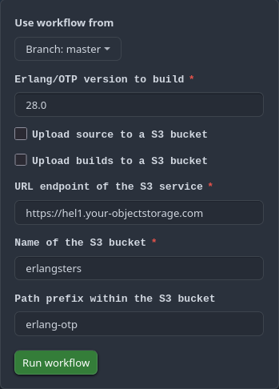

# Build Erlang/OTP

This repository contains a Github Actions workflow to build Erlang/OTP from its
source files. By default, it uploads the build artifacts to the Erlangsters
[S3 bucket](https://storage.erlangsters.org/erlang/) but it can be customized
to send them to your own S3 bucket.

Artifacts produced by this workflow are kept in a S3 bucket and are made
available to the community. It's also used by this Github
[JavaScript action](https://github.com/erlangsters/setup-erlang) to set up
Erlang/OTP on your Github runners.

Written by the Erlangsters [community](https://about.erlangsters.org/) and
released under the MIT [license](/https://opensource.org/license/mit).

## How to use

Unless you want to maintain your own builds of Erlang (or perhaps make some
experiments), you don't need this "Erlang builder". But in the case you do,
start with forking this repository on Github.

On Github, head to the "Actions" tab and select the "Build Erlang" workflow.
From there, you are able to trigger the Github Actions workflow with the
following inputs.

- The Erlang version to build
- Whether you want the artifacts uploaded to a S3 bucket
- The parameters of the targeted S3 bucket

Click "Run workflow" and the result will be made available as artifacts after
completion of the workflow (if successful).

It uses the Github-hosted runner to build Erlang for the following platforms.

- Debian (AMD64 and ARM64)
- Alpine (AMD64 and ARM64)
- macOS (ARM64 only)
- Windows (AMD64 only)

While 'Debian' and 'Alpine' are specific Linux distributions, we're using these
terms to broadly represent Linux systems built on either the glibc or musl C
library.

Note that you must create two large runners called `linux-amd64` and
`linux-arm64` for the Linux builds.

The `wx` and `jinterface` applications are not included. Also, the `obdc`
application is only included in Linux builds. See the
[platforms](#platform-availability) section below for platform-specific
information.

The supported Erlang/OTP versions and how support evolves over time is
explained in the [version availability](#version-availability) section.

The source files of Erlang/OTP are taken directly from Github
(https://github.com/erlang/otp/releases) as published by the Erlang/OTP team.

## Build (and source) artifacts

The workflow will produce downloadable artifacts (from Github) that are named
using the following.

- `erlang-source` - The
- `erlang-build-debian-amd64`
- `erlang-build-debian-arm64` (if enabled)
- `erlang-build-alpine-amd64`
- `erlang-build-alpine-arm64` (if enabled)
- `erlang-build-macos-arm64`
- `erlang-build-window-amd64`

Inside the archives, you will always find a folder named `otp_src_<version>`
for the source archive, and `otp_build_<version>` for the build archives.

## S3 bucket

If uploading the artifacts to a S3 bucket is needed, enable it by ticking the
"Upload to source/builds S3 bucket" checkbox, then the workflow will do the
uploading.

However, it requires write permission which can be given by adding the
following Action secrets to your repository.

- `S3_BUCKET_ACCESS_KEY`
- `S3_BUCKET_SECRET_KEY`

All artifacts will be uploaded in the `/<path-prefix>/<version>/` folder in the
S3 bucket and have the following naming. (Note that the path prefix can be `.`
which means it will result in the `/<version/` folder.)

- `erlang-<version>-source.tar.gz` (for the source tarball)
- `erlang-<version>-build-<platform>.tar.gz`

Where the naming scheme of `platform` value is
`<linux|linux-musl|macos|windows>-<amd64|amd64>`.

## Version availability

All software has a lifespan and it would be ridiculous to insist in maintaining
support for versions of Erlang/OTP when they get old. Therefore, as time
passes, support for those versions are simply dropped.

The current supported versions are:

- Erlang/OTP 25.x
- Erlang/OTP 26.x
- Erlang/OTP 27.x
- Erlang/OTP 28.x

No rule is defined to decide on those supported versions. It's simply decided
based on what's commonly needed by the community.

## Platform availability

Builds are produced for the following platforms.

- Linux (glibc and musl, AMD64 and ARM64)
- macOS (ARM64)
- Windows (AMD64)

No support for macOS AMD64 are planned, and no support for Windows ARM64 are
planned until the Erlang/OTP team officially supports it.

Additionally, Linux builds are produced for both glibc (as used by most distros
such as Debian) and musl (used by the Alpine distro, commonly used to yield
tiny images).

The default `./configure` is used, which should includes both the `emu` and
`jit` flavors. No debug builds are produced.

**Linux builds**

The Linux builds for glibc as libc are produced in Dockerized environment using
the `debian:12` with the following installed packages.

- `autoconf`
- `gcc`
- `g++`
- `make`
- `libncurses5-dev`
- `libssl-dev`
- `unixodbc-dev`

The Linux builds for musl as libc are produced in Dockerized environment using
the `alpine:3` with the following installed packages.

- `autoconf`
- `gcc`
- `g++`
- `make`
- `ncurses-dev`
- `openssl-dev`
- `unixodbc-dev`

In all builds, the `wx` and `jinterface` applications are disabled and excluded
from the result.

**macOS builds**

The macOS builds are produced in the Github-hosted runner named `macos-14`.

It's hard to tell its exact environment.

The `wx`, `jinterface` and `odbc` applications are disabled and excluded from
the result.

**Windows builds**

The Windows builds are produced in the Github-hosted runner named
`windows-2022`. The build happens in a WSL environment with Ubuntu 18.08.

It's hard to tell the exact environment.

The `wx`, `jinterface` and `odbc` applications are disabled and excluded from
the result.

## Build consistency

In a fast changing environment with so many dependencies to keep track of, it's
hard to keep consistency in a produced build at T1 and T2. However, this
builder does what it can to yield as much consistency (such as assigning
specific image versions instead of using "the latest one").

Of course, it will always be influenced by external factors.
